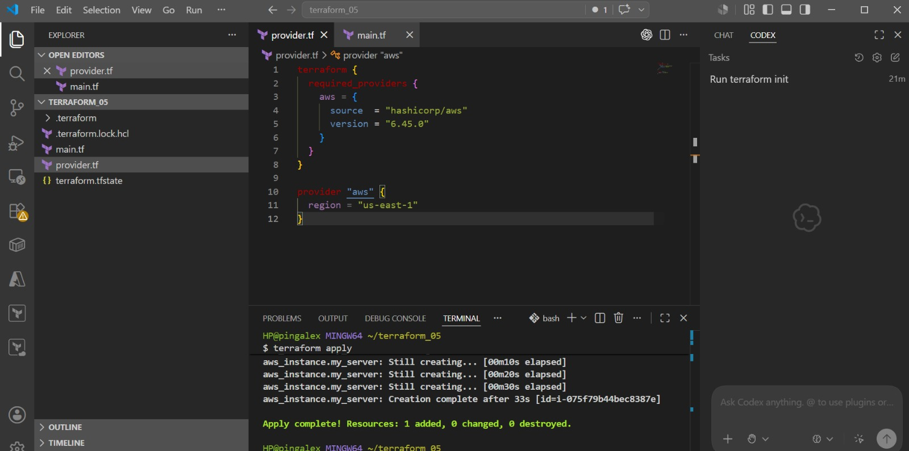
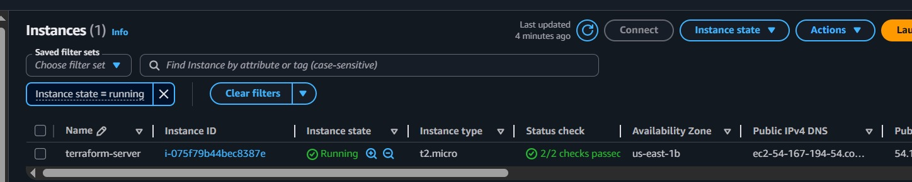

# Terraform AWS EC2 Project

## Project Overview

This project demonstrates how to provision an AWS EC2 instance using Terraform.

The goal of this project is to teach beginners how to provision Infrastructure as Code (IaC) on AWS using Terraform and Amazon Web Services (AWS). It demonstrates a real-world DevOps workflow for automating cloud infrastructure.

---

## Architecture Diagram



---

## EC2 Instance Created



---

## What I Built

I provisioned an AWS EC2 instance using Terraform.

The instance was created with the following Terraform configuration:

```hcl
resource "aws_instance" "my_server" {
  ami           = "ami-0c02fb55956c7d316"
  instance_type = "t2.micro"

  tags = {
    Name = "terraform-server"
  }
}
```

---

## Tools Used

- Terraform
- AWS (Amazon Web Services)
- AWS CLI
- Visual Studio Code
- Git Bash
- Git & GitHub

---

## Step-by-Step Workflow

### 1. Create the Project Folder

```bash
terraform_05
```

---

### 2. Create Terraform Files

Inside the folder, I created two main files:

```text
provider.tf
main.tf
```

---

### 3. Configure the AWS Provider

In `provider.tf`, I configured the AWS provider:

```hcl
terraform {
  required_providers {
    aws = {
      source  = "hashicorp/aws"
      version = "6.45.0"
    }
  }
}

provider "aws" {
  region = "us-east-1"
}
```

---

### 4. Initialize Terraform

```bash
terraform init
```

This downloaded the AWS provider and created:

```text
.terraform/
.terraform.lock.hcl
```

---

### 5. Validate the Configuration

```bash
terraform validate
```

Terraform confirmed:

```bash
Success! The configuration is valid.
```

---

### 6. Preview the Infrastructure

```bash
terraform plan
```

---

### 7. Apply the Configuration

```bash
terraform apply
```

Terraform successfully created the EC2 instance:

```bash
Apply complete! Resources: 1 added, 0 changed, 0 destroyed.
```

---

### 8. Verify the EC2 Instance

I checked the AWS EC2 Console and confirmed that the instance named:

```text
terraform-server
```

was running successfully.

---

### 9. Destroy the Infrastructure

To avoid unnecessary AWS charges, I destroyed the infrastructure:

```bash
terraform destroy
```

---

## Project Structure

```text
terraform_05/
│
├── images/
│   ├── architecture.png
│   └── ec2-output.png
│
├── main.tf
├── provider.tf
├── README.md
└── .gitignore
```

---

## Terraform Configuration

### provider.tf

```hcl
terraform {
  required_providers {
    aws = {
      source  = "hashicorp/aws"
      version = "6.45.0"
    }
  }
}

provider "aws" {
  region = "us-east-1"
}
```

### main.tf

```hcl
resource "aws_instance" "my_server" {
  ami           = "ami-0c02fb55956c7d316"
  instance_type = "t2.micro"

  tags = {
    Name = "terraform-server"
  }
}
```

---

## Terraform Commands

### Initialize Terraform

```bash
terraform init
```

### Validate Configuration

```bash
terraform validate
```

### Preview Infrastructure

```bash
terraform plan
```

### Provision Infrastructure

```bash
terraform apply
```

### Destroy Infrastructure

```bash
terraform destroy
```

---

## Key Concepts Learned

- Terraform basics
- Infrastructure as Code (IaC)
- AWS provider configuration
- EC2 provisioning
- Terraform workflow
- Terraform state management
- Infrastructure lifecycle management
- Cloud automation

---

## Key Takeaway

This project demonstrates how DevOps engineers automate infrastructure using Terraform and AWS.

It also highlights the importance of Infrastructure as Code (IaC) in modern cloud engineering and DevOps practices.

---

## Conclusion

Through this project, I gained hands-on experience provisioning cloud infrastructure with Terraform on AWS.

This beginner-friendly project demonstrates the complete Terraform workflow from initialization to deployment and infrastructure cleanup.
